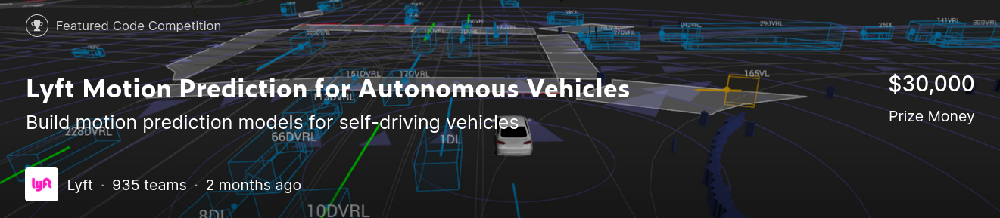

# The 3rd place solution for competition "Lyft Motion Prediction for Autonomous Vehicles" at Kaggle



### Team behind this solution:
1. Artsiom Sanakoyeu [[Homepage](https://gdude.de)] [[Twitter](https://twitter.com/artsiom_s)] [[Telegram Channel](https://t.me/gradientdude)] [[LinkedIn](https://www.linkedin.com/in/sanakoev)]
2. Dmytro Poplavskiy [[Kaggle]](https://www.kaggle.com/dmytropoplavskiy) [[LinkedIn]](https://www.linkedin.com/in/dmytropoplavskiy/)
3. Artsem Zhyvalkouski [[Kaggle]](https://www.kaggle.com/aruchomu) [[Twitter]](https://twitter.com/artem_aruchomu) [[GitHub]](https://github.com/heartkilla) [[LinkedIn]](https://www.linkedin.com/in/zhyvalkouski/)

### Explanation of the solution:
▶️  Video: https://youtu.be/3Yz8_x38qbc  
📜 Blogpost: https://gdude.de/blog/2021-02-05/Kaggle-Lyft-solution 
📝 Brief solution writeup: https://www.kaggle.com/c/lyft-motion-prediction-autonomous-vehicles/discussion/205376

## How to reproduce results
0. [Optional] Set the paths in the configs. But the default paths should work as well.
  - Set path where to store prerendered dataset in [src/1st_level/config.py](src/1st_level/config.py)
  - Set path where the predicts of the 1st level models are saved in [src/2nd_level/config.py](src/2nd_level/config.py)

1. Install dependencies. 
  - `pip install -r requirements.txt`
  - Apply patch to l5kit with `./apply_l5kit_patch.sh` (it disables processing of rasterized images to allow rasterizer to return multiple results).

2. Download and prepare data.
```
bash prepare_data_train.sh
```
3. Train 1st level models.
```
bash train.sh
```
4. Run inference of 1st level models on the test set.  
You may need to change which chekpoints to load when predicting (in [predict_test_l1.sh](predict_test_l1.sh)), as the best epoch may change after you retrain the models.
```
bash prepare_data_test.sh
bash predict_test_l1.sh
```
4. Train 2nd level model on the predicts of the 1st level models on the test set.
```
cd src/2nd_level && python train.py
```
Make sure you've set all paths right in `2nd_level/config.py` w.r.t. the `2nd_level` directory.

6. Predict on the test set using the 2nd level model.
```
cd src/2nd_level && python infer.py
```

The file witn final predictions will be saved to `src/2nd_level/submission.csv'.  

Directory structure example (i.e., how it should look like after everything is trained and predicted) is in [directory_structure.txt](directory_structure.txt).


## Extra
- To skip training the 1st level models, you can download the pretrained weights by running `bash download_1st_level_weights.sh`.
- To skip training and inference of the 1st level models, you can download all predicts. More details on this are in [src/1st_level/submissions](src/1st_level/submissions).
- More details on how to use 2nd level model are in [src/2nd_level](src/2nd_level).
- Our final 2nd level model with *9.404 Private LB score* is already committed in this repository ([src/2nd_level/transformer.bin](src/2nd_level/transformer.bin)). To run inference using this model you can directly execute `cd src/2nd_level && python infer.py`.

